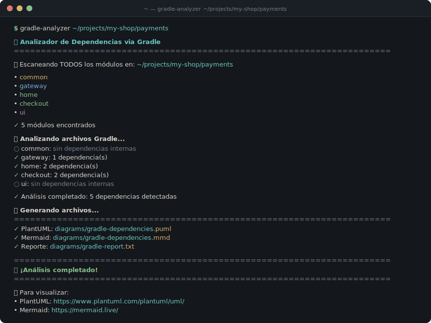
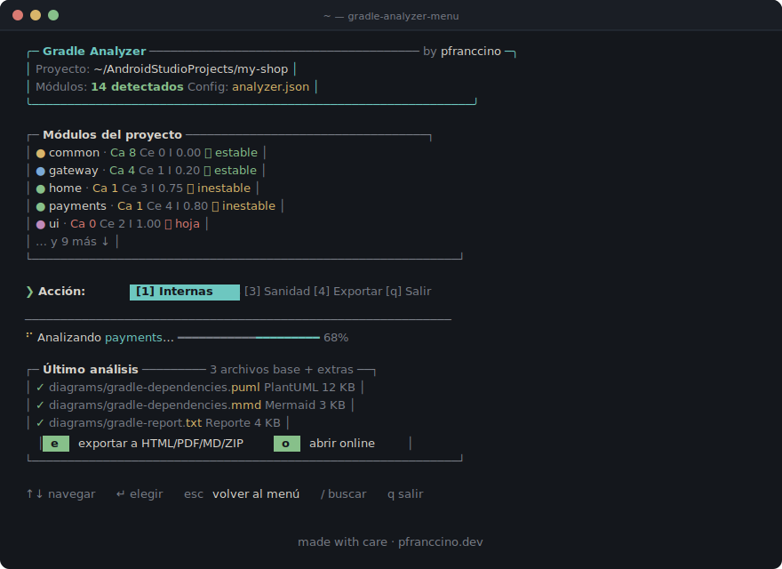

<div align="center">

# 📊 Android Gradle Dependency Analyzer

Herramientas para **analizar, visualizar y medir la salud** de las dependencias entre módulos en proyectos Android multi-módulo.

[](https://www.python.org/)
[](LICENSE)
[](https://plantuml.com)



</div>

---

## ⚡ Quick start

```bash
# Recomendado · instalación global con pipx
pipx install git+https://github.com/pfranccino/android-gradle-analyzer.git

# 1 · Dependencias internas de un módulo
gradle-analyzer /ruta/a/tu/proyecto/payments

# 2 · Quién llama a un módulo desde fuera
gradle-externals /ruta/a/tu/proyecto payments

# 3 · Score de sanidad (Ca/Ce/I, ciclos, anti-patrones)
gradle-sanity /ruta/a/tu/proyecto/payments
```

<details>
<summary><b>Alternativa · clonar el repo</b> (para desarrollo o contribuir)</summary>

```bash
git clone https://github.com/pfranccino/android-gradle-analyzer.git
cd android-gradle-analyzer
pip install -r requirements.txt
python3 gradle_analyzer.py /ruta/a/tu/proyecto/payments
```

</details>

---

## 🎛️ Modo interactivo

Un único comando con dashboard, autodetección de módulos, navegación con teclado y export a HTML / Markdown / ZIP.

```bash
gradle-analyzer-menu
```

<div align="center">

</div>

**Modo no-interactivo (CI/scripts):**
```bash
gradle-analyzer-menu --quick sanity /ruta/proyecto
gradle-analyzer-menu --version
```

---

## ✨ Qué hace

<table>
<tr>
<td width="33%" valign="top">

### 🔍 Dependencias internas
Lee `build.gradle` / `build.gradle.kts` recursivamente y dibuja cómo dependen los módulos entre sí.

**Salida** · PlantUML · Mermaid · reporte de texto

</td>
<td width="33%" valign="top">

### 🌐 Llamadas externas
Detecta qué módulos de **fuera** de tu feature lo están consumiendo. Útil para refactors seguros.

**Salida** · PlantUML · Mermaid · reporte de texto

</td>
<td width="33%" valign="top">

### 🏥 Sanidad arquitectónica
Métricas Ca/Ce/I, detección de ciclos, violaciones SDP y score 0–100 con explicación.

**Salida** · reporte detallado

</td>
</tr>
</table>

### Características destacadas

- ✅ **Detección recursiva** sin importar la profundidad de los módulos
- 🎨 **Colores por tipo** (common, gateway, features)
- ⚠️ **Detección automática de ciclos**
- 🔭 **Scopes soportados:** `implementation`, `api`, `kapt`, `compileOnly`, `testImplementation`, y más
- ⚙️ **Configuración personalizable** via `analyzer_config.json`

---

## 📖 Uso

<details>
<summary><b>1. Analizar dependencias internas</b></summary>

```bash
gradle-analyzer <ruta_al_modulo>
```

| Flag | Descripción | Default |
|---|---|---|
| `--format plantuml\|mermaid\|all` | Formato de salida | `all` |
| `--output-dir <dir>` | Directorio de salida | `diagrams` |
| `--exclude <module>` | Excluir un módulo (puede repetirse) | — |
| `--config <path>` | Ruta a `analyzer_config.json` personalizado | auto-detect |

**Ejemplos:**

```bash
# Solo Mermaid
gradle-analyzer /ruta/proyecto/payments --format mermaid

# Excluir módulos de test
gradle-analyzer /ruta/proyecto/payments --exclude test-utils --exclude mocks

# Output personalizado
gradle-analyzer /ruta/proyecto/payments --output-dir docs/diagrams
```

**Genera:**
- `diagrams/gradle-dependencies.puml`
- `diagrams/gradle-dependencies.mmd`
- `diagrams/gradle-report.txt`

</details>

<details>
<summary><b>2. Analizar llamadas externas</b></summary>

```bash
gradle-externals <ruta_proyecto> <nombre_modulo>
```

| Flag | Descripción | Default |
|---|---|---|
| `--format plantuml\|mermaid\|all` | Formato de salida | `all` |
| `--output-dir <dir>` | Directorio de salida | `external-calls` |
| `--config <path>` | Config personalizado | auto-detect |

**Genera:**
- `external-calls/<modulo>-external-calls.puml`
- `external-calls/<modulo>-external-calls.mmd`
- `external-calls/<modulo>-external-report.txt`

</details>

<details>
<summary><b>3. Analizar sanidad arquitectónica</b></summary>

```bash
gradle-sanity <ruta_al_modulo>
```

| Flag | Descripción | Default |
|---|---|---|
| `--output-dir <dir>` | Directorio de salida | `sanity` |
| `--config <path>` | Config personalizado | auto-detect |

**Ejemplo de reporte:**

```
MÉTRICAS POR MÓDULO

  Módulo          Ca   Ce     I    Estado
  ──────────────  ───  ───  ────   ──────────────────────────
  common           3    0   0.00   🟢 Estable
  gateway          1    1   0.50   🟡 Moderadamente estable
  home             1    2   0.67   🟠 Moderadamente inestable
  ui               0    2   1.00   🔴 Inestable (módulo hoja)

VIOLACIONES DETECTADAS

🔴 CICLOS (0)            — sin ciclos ✅
🟠 VIOLACIONES SDP (0)   — sin violaciones ✅
🟡 API INNECESARIO (1)   — ui usa api pero Ca=0
🔵 VERSIONES HARD. (2)   — gateway, home

PUNTUACIÓN FINAL: 91 / 100  🟢 Excelente
```

**¿Qué mide cada columna?**

| Columna | Significado |
|---|---|
| **Ca** | Cuántos módulos dependen de éste (fan-in). Alto en `common`, `core`. |
| **Ce** | De cuántos depende éste (fan-out). Alto en `app` o features de alto nivel. |
| **I** | `Ce / (Ce + Ca)`. 0 = muy estable, 1 = muy inestable. |

**¿Qué detecta?**

| Problema | Penalización default | Descripción |
|---|---|---|
| Ciclo | −20 pts | A depende de B y B depende de A |
| Violación SDP | −10 pts | Estable depende de inestable |
| `api` innecesario | −5 pts | Usa `api` pero `Ca=0` |
| Fan-out excesivo | −3 pts | `Ce` supera el umbral (default: 5) |
| Versión hardcodeada | −2 pts | `"lib:x:1.2.3"` en vez de Version Catalog |

Los pesos son configurables en `analyzer_config.json` bajo `sanity_weights`.

</details>

<details>
<summary><b>4. Generar imágenes desde PlantUML</b></summary>

```bash
# PNG
plantuml diagrams/gradle-dependencies.puml
plantuml diagrams/*.puml external-calls/*.puml

# SVG (escalable)
plantuml -tsvg diagrams/gradle-dependencies.puml
```

**Instalar PlantUML:**

```bash
brew install plantuml          # macOS
sudo apt install plantuml      # Ubuntu/Debian
choco install plantuml         # Windows
```

</details>

---

## 🎨 Configuración personalizada

Sin config, el analizador usa defaults genéricos para cualquier proyecto Android. Si querés personalizar colores, íconos y estilos:

```bash
cp analyzer_config.example.json analyzer_config.json
```

<details>
<summary><b>Ejemplo de configuración</b></summary>

```json
{
  "icons": {
    "payment": "💸",
    "cart":    "🛒",
    "auth":    "🔐"
  },
  "colors": {
    "cycle": "#FF0000"
  }
}
```

Solo incluí los campos que querés cambiar — el resto usa defaults.

**Orden de búsqueda:**
1. `--config <path>` explícito
2. `analyzer_config.json` en el directorio actual
3. Defaults internos

</details>

---

## 🔭 Scopes soportados

| Scope | Categoría visual |
|---|---|
| `api`, `implementation`, `compileOnly` | Flecha sólida (compile) |
| `kapt`, `annotationProcessor` | Flecha punteada (build) |
| `testImplementation`, `androidTestImplementation`, `debugImplementation`, `releaseImplementation`, `runtimeOnly`, `testRuntimeOnly` | Flecha punteada con label (test/debug) |

---

## 📋 Más info

<details>
<summary><b>Estructura del proyecto</b></summary>

```
android-gradle-analyzer/
├── README.md
├── LICENSE
├── CONTRIBUTING.md
├── EXAMPLES.md
├── pyproject.toml               ← instalación via pipx
├── requirements.txt             ← uso directo (git clone)
├── setup.sh
├── menu.py                      ← wrapper: python3 menu.py
├── menu/                        ← paquete del menú interactivo
│   ├── actions.py
│   ├── branding.py
│   ├── exporter.py
│   ├── prompts.py
│   ├── state.py
│   └── ui.py
├── analyzer_utils.py            ← utilidades compartidas
├── analyzer_config.example.json ← config de ejemplo
├── gradle_analyzer.py           ← script 1: dependencias internas
├── external_callers.py          ← script 2: llamadas externas
└── gradle_sanity.py             ← script 3: sanidad + score
```

</details>

<details>
<summary><b>Cómo funciona internamente</b></summary>

**Detección de módulos**
1. `rglob()` busca recursivamente todos los `build.gradle*`.
2. Paths → nombres: `payments/home` → `payments:home`.

**Extracción de dependencias**
1. Lee cada `build.gradle`.
2. Regex sobre cada scope: `implementation project(":...")`, `api(project(":..."))`, `kapt project(':...')`, etc.
3. Normaliza y guarda las relaciones por scope.

**Generación de diagramas**
1. Clasifica módulos por tipo (common, gateway, features).
2. Aplica colores según clasificación.
3. Genera PlantUML/Mermaid agrupados por categoría visual.
4. Marca en rojo los módulos involucrados en ciclos.

</details>

<details>
<summary><b>Ajustar espaciado de diagramas</b></summary>

En `gradle_analyzer.py`, función `generate_plantuml()`:

```python
"skinparam nodesep 150",    # Horizontal
"skinparam ranksep 150",    # Vertical
"skinparam padding 30",     # Interno
```

| Estilo | nodesep / ranksep / padding |
|---|---|
| Compacto | 60 / 60 / 10 |
| Balanceado | 100 / 100 / 20 |
| Espacioso | 150 / 150 / 30 |

</details>

<details>
<summary><b>Troubleshooting</b></summary>

**"No se encontró gradle para: [módulo]"**
El módulo no tiene `build.gradle` ni `build.gradle.kts`. Verificá el path.

**Diagrama apretado**
Subí los valores de espaciado (ver sección anterior).

**No detecta algunas dependencias**
El formato del gradle puede ser distinto al estándar. Revisá los patrones en `analyzer_utils.py` (constante `DEPENDENCY_SCOPES`).

**El menú no arranca tras clonar**
Instalá las dependencias: `pip install -r requirements.txt`

</details>

<details>
<summary><b>Referencias del análisis de sanidad</b></summary>

Las métricas de `gradle_sanity.py` están basadas en fuentes verificadas:

- **Low coupling / High cohesion en Android** — [Guide to Android app modularization](https://developer.android.com/topic/modularization) · [Common modularization patterns](https://developer.android.com/topic/modularization/patterns)
- **Métricas Ca, Ce, I** — [Efferent coupling — Wikipedia](https://en.wikipedia.org/wiki/Efferent_coupling). `I = Fan-out / (Fan-in + Fan-out)`, rango [0, 1].
- **Stable Dependencies Principle** — [Software Coupling Metrics — entrofi.net](https://www.entrofi.net/coupling-metrics-afferent-and-efferent-coupling/). El umbral 0.3 es un parámetro configurable, no parte del SDP original.
- **DAGP** — [dependency-analysis-gradle-plugin](https://github.com/autonomousapps/dependency-analysis-gradle-plugin). Inspiró la detección de scopes mal declarados.
- **Detección de ciclos** — DFS con coloreo de nodos (blanco/gris/negro).

> El **score 0–100 no es un estándar externo.** Es orientativo con pesos razonables como punto de partida, ajustables en `analyzer_config.json` bajo `sanity_weights`.

</details>

---

## 🤝 Contribuir

Las contribuciones son bienvenidas. Forkeá, creá una rama, commiteá y abrí un PR. Ver [CONTRIBUTING.md](CONTRIBUTING.md) para detalles.

## 📄 Licencia

MIT — ver [LICENSE](LICENSE).

---

<div align="center">

made with care · [pfranccino.dev](https://pfranccino.dev)

</div>
