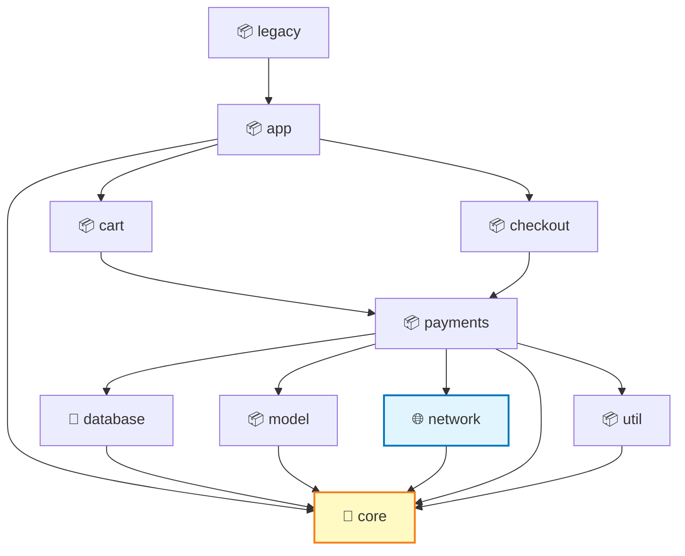

<div align="center">

# 📊 Android Gradle Dependency Analyzer

Herramientas para **analizar, visualizar y medir la salud** de las dependencias entre módulos en proyectos Android multi-módulo.

[](https://www.python.org/)
[](https://github.com/pfranccino/android-gradle-analyzer/actions/workflows/release.yml)
[](https://github.com/pfranccino/android-gradle-analyzer/releases)
[](LICENSE)
[](https://plantuml.com)

</div>

---

## 👀 En 30 segundos

Todo lo de abajo es **salida real**, no maquetas: se reproduce clonando el repo y corriendo el comando contra los fixtures incluidos en `tests/fixtures/leaf_coupling`.

```console
$ gradle-analyzer tests/fixtures/leaf_coupling
🚀 Analizador de Dependencias via Gradle
======================================================================
📁 Escaneando módulos en: .../tests/fixtures/leaf_coupling

  • app   • cart   • checkout   • core   • database
  • legacy   • model   • network   • payments   • util

✓ 10 módulos encontrados

🔍 Analizando dependencias (motor: static)...
  ✓ app: 3 dependencia(s)
  ✓ payments: 5 dependencia(s)
  ○ core: sin dependencias internas
  ...
✓ Análisis completado: 15 dependencias detectadas

📊 Generando archivos...
✓ PlantUML: diagrams/gradle-dependencies.puml
✓ Mermaid:  diagrams/gradle-dependencies.mmd
✓ Reporte:  diagrams/gradle-report.txt
```

El Mermaid que genera lo renderiza GitHub directamente — este es el grafo real de ese proyecto de ejemplo:


```mermaid
graph TD
  app["📦 app"]
  cart["📦 cart"]
  checkout["📦 checkout"]
  core["🔧 core"]
  database["💾 database"]
  legacy["📦 legacy"]
  model["📦 model"]
  network["🌐 network"]
  payments["📦 payments"]
  util["📦 util"]

  app --> cart
  app --> checkout
  app --> core
  cart --> payments
  checkout --> payments
  database --> core
  legacy --> app
  model --> core
  network --> core
  payments --> core
  payments --> database
  payments --> model
  payments --> network
  payments --> util
  util --> core

  classDef commonStyle  fill:#FFF9C4,stroke:#F57F17,stroke-width:2px
  classDef gatewayStyle fill:#E1F5FE,stroke:#0277BD,stroke-width:2px
  class core commonStyle
  class network gatewayStyle
```

---

## ⚡ Quick start

```bash
# Recomendado · instalación global con pipx desde PyPI
pipx install android-gradle-analyzer

# Con parser AST para .gradle.kts (maneja multilínea y comentarios correctamente)
pipx install "android-gradle-analyzer[kts]"

# Última versión de desarrollo (sin esperar al release en PyPI)
pipx install git+https://github.com/pfranccino/android-gradle-analyzer.git

# Ver versión instalada
gradle-analyzer-menu --version
#  → android-gradle-analyzer 1.4.0 · by pfranccino · https://pfranccino.dev
```

Los cuatro análisis, cada uno con su CLI:

```bash
# 1 · Dependencias internas de un módulo
gradle-analyzer /ruta/a/tu/proyecto/payments

# 2 · Quién llama a un módulo desde fuera (refactors seguros)
gradle-externals /ruta/a/tu/proyecto payments

# 3 · Score de sanidad (Ca/Ce/I, ciclos, anti-patrones)
gradle-sanity /ruta/a/tu/proyecto/payments

# 4 · Impacto de cambios — qué se rompe si cambio X
gradle-impact /ruta/a/tu/proyecto payments:common
```

> **Tip:** todos aceptan `.` si ya estás dentro del módulo, `--quiet` para silenciar el progreso y `--json` para salida parseable.

<details>
<summary><b>Alternativa · clonar el repo</b> (para desarrollo o contribuir)</summary>

```bash
git clone https://github.com/pfranccino/android-gradle-analyzer.git
cd android-gradle-analyzer
pip install -e ".[kts,yaml]"
gradle-analyzer tests/fixtures/leaf_coupling
```

</details>

---

## 🎛️ Modo interactivo

Un único comando con dashboard, autodetección de módulos, navegación con teclado y export a HTML / Markdown / ZIP.

```bash
gradle-analyzer-menu
```

**Modo no-interactivo (CI/scripts):**

```bash
gradle-analyzer-menu --quick sanity /ruta/proyecto
gradle-analyzer-menu --version
```

---

## ✨ Qué hace

<table>
<tr>
<td width="25%" valign="top">

### 🔍 Dependencias internas
Lee `build.gradle` / `build.gradle.kts` recursivamente y dibuja cómo dependen los módulos entre sí.

**Salida** · PlantUML · Mermaid · reporte de texto

</td>
<td width="25%" valign="top">

### 🌐 Llamadas externas
Detecta qué módulos de **fuera** de tu feature lo están consumiendo. Útil para refactors seguros.

**Salida** · PlantUML · Mermaid · reporte de texto

</td>
<td width="25%" valign="top">

### 🏥 Sanidad arquitectónica
Métricas Ca/Ce/I, detección de ciclos, violaciones SDP y score 0–100 con explicación.

**Salida** · reporte detallado · JSON

</td>
<td width="25%" valign="top">

### 💥 Impacto de cambios
Dado un módulo, muestra qué otros módulos se romperían si cambia (BFS sobre el grafo invertido de dependencias).

**Salida** · PlantUML · Mermaid · reporte de texto

</td>
</tr>
</table>

### Características destacadas

- ✅ **Detección recursiva** sin importar la profundidad de los módulos
- 📋 **`settings.gradle(.kts)`** como fuente de verdad para los módulos (si existe)
- 🎯 **Type-safe project accessors** (`projects.foo.barBaz`, Gradle 7+) junto al formato clásico `project(":foo:bar")`
- 🌳 **Parser AST para `.kts`** (opcional) — usa tree-sitter-kotlin para manejar dependencias multilínea y comentadas
- 🎯 **Motor dinámico vía Gradle** (opcional, `--engine dynamic`) — lee la verdad que Gradle resuelve: precisión total con Version Catalogs, variables y convention plugins
- ⚠️ **Detección automática de ciclos** y **lógica compartida mal ubicada**
- 🔭 **Scopes soportados:** `implementation`, `api`, `kapt`, `compileOnly`, `testImplementation`, y más
- 🤫 **`--quiet`** · 📄 **`--json`** en todos los CLIs · 🚦 **`--fail-on-cycle` / `--fail-on-score-below N`** en `gradle-sanity` para CI

---

## 🧠 Motor de extracción: estático vs dinámico

Todos los análisis aceptan `--engine static|dynamic|auto` (default `static`).

| | **static** (default) | **dynamic** | **auto** |
|---|---|---|---|
| Cómo obtiene las dependencias | Parsea `build.gradle(.kts)` con regex/tree-sitter | Ejecuta `gradlew -I <init script>` y lee lo que Gradle resuelve | Dynamic si hay `gradlew` y configura; si no, static |
| Precisión | Alta para `project(...)` y accessors | **Total** (Version Catalogs, variables, convention plugins) | La mejor disponible |
| Requisitos | Ninguno (Python puro) | JDK + wrapper de Gradle en la raíz | — |
| Seguridad | Solo lee texto (seguro en repos no confiables) | **Ejecuta el build del proyecto** | Solo ejecuta si hay wrapper |

> ⚠️ **Seguridad:** `--engine dynamic` ejecuta el build del proyecto analizado. Úsalo solo sobre repos de confianza. El motor `static` (default) nunca ejecuta nada: solo lee texto.

Detalle completo, garantías y ejemplos en **[Motor estático vs dinámico](https://github.com/pfranccino/android-gradle-analyzer/wiki/Motor-estatico-vs-dinamico)** (wiki).

---

## 🚦 Integración CI/CD

`gradle-sanity` puede fallar la build si detecta problemas:

```bash
# Falla si hay ciclos, o si el score cae por debajo de 70
gradle-sanity /ruta/proyecto --fail-on-cycle --fail-on-score-below 70 --quiet

# Salida JSON para parsear en el pipeline
gradle-sanity /ruta/proyecto --json > sanity-report.json
```

Workflow listo para copiar en **[Integración CI](https://github.com/pfranccino/android-gradle-analyzer/wiki/Integracion-CI)** (wiki) y en [`examples/github-actions-dependency-health.yml`](examples/github-actions-dependency-health.yml).

---

## 📚 Documentación

El detalle vive en el **[Wiki](https://github.com/pfranccino/android-gradle-analyzer/wiki)**, con salida real en cada página:

| Página | Contenido |
|---|---|
| **[Comandos](https://github.com/pfranccino/android-gradle-analyzer/wiki/Comandos)** | Los 4 CLIs: flags, archivos generados y salida real de cada uno |
| **[Métricas de sanidad](https://github.com/pfranccino/android-gradle-analyzer/wiki/Metricas-de-sanidad)** | Ca/Ce/I, qué detecta el score y las referencias (Uncle Bob, ADP/SDP/SAP) |
| **[Motor estático vs dinámico](https://github.com/pfranccino/android-gradle-analyzer/wiki/Motor-estatico-vs-dinamico)** | Cuándo usar cada uno y sus garantías |
| **[Configuración](https://github.com/pfranccino/android-gradle-analyzer/wiki/Configuracion)** | `analyzer_config.json`, `analyzer.yml` y el detector de acoplamiento |
| **[Integración CI](https://github.com/pfranccino/android-gradle-analyzer/wiki/Integracion-CI)** | Gates, JSON y GitHub Actions |
| **[Cómo funciona](https://github.com/pfranccino/android-gradle-analyzer/wiki/Como-funciona)** | Detección de módulos, extracción y generación de diagramas |
| **[Troubleshooting](https://github.com/pfranccino/android-gradle-analyzer/wiki/Troubleshooting)** | Problemas comunes y soluciones |

¿Buscas recetas end-to-end (auditoría, onboarding, refactor seguro)? → **[EXAMPLES.md](EXAMPLES.md)**.

---

## 🤝 Contribuir

Las contribuciones son bienvenidas. Forkea, crea una rama, commitea y abre un PR. Ver [CONTRIBUTING.md](CONTRIBUTING.md) para detalles.

## 📄 Licencia

MIT — ver [LICENSE](LICENSE).

---

<div align="center">

made with care · [pfranccino.dev](https://pfranccino.dev)

</div>
