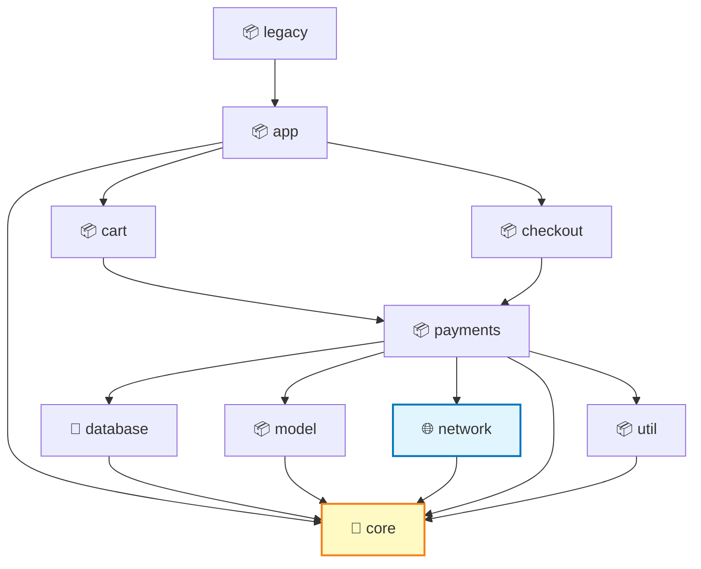

<div align="center">

# 📊 Android Gradle Dependency Analyzer

Tools to **analyze, visualize, and measure the health** of module dependencies in Android multi-module projects.

[](https://www.python.org/)
[](https://github.com/pfranccino/android-gradle-analyzer/actions/workflows/release.yml)
[](https://github.com/pfranccino/android-gradle-analyzer/releases)
[](LICENSE)
[](https://plantuml.com)

</div>

---

## 👀 In 30 seconds

Everything below is **real output**, not mockups: reproduce it by cloning the repo and running the command against the fixtures included in `tests/fixtures/leaf_coupling`.

```console
$ gradle-analyzer tests/fixtures/leaf_coupling
🚀 Gradle Dependency Analyzer
======================================================================
📁 Scanning modules in: .../tests/fixtures/leaf_coupling

  • app   • cart   • checkout   • core   • database
  • legacy   • model   • network   • payments   • util

✓ 10 modules found

🔍 Analyzing dependencies (engine: static)...
  ✓ app: 3 dependency(ies)
  ✓ payments: 5 dependency(ies)
  ○ core: no internal dependencies
  ...
✓ Analysis complete: 15 dependencies detected

📊 Generating files...
✓ PlantUML: diagrams/gradle-dependencies.puml
✓ Mermaid:  diagrams/gradle-dependencies.mmd
✓ Report:   diagrams/gradle-report.txt
```

The Mermaid output renders directly on GitHub — this is the real graph of that sample project:


```mermaid
graph TD
  app["📦 app"]
  cart["📦 cart"]
  checkout["📦 checkout"]
  core["🔧 core"]
  database["💾 database"]
  legacy["📦 legacy"]
  model["📦 model"]
  network["🌐 network"]
  payments["📦 payments"]
  util["📦 util"]

  app --> cart
  app --> checkout
  app --> core
  cart --> payments
  checkout --> payments
  database --> core
  legacy --> app
  model --> core
  network --> core
  payments --> core
  payments --> database
  payments --> model
  payments --> network
  payments --> util
  util --> core

  classDef commonStyle  fill:#FFF9C4,stroke:#F57F17,stroke-width:2px
  classDef gatewayStyle fill:#E1F5FE,stroke:#0277BD,stroke-width:2px
  class core commonStyle
  class network gatewayStyle
```

---

## ⚡ Quick start

```bash
# Recommended · global install with pipx from PyPI
pipx install android-gradle-analyzer

# With AST parser for .gradle.kts (handles multiline and commented dependencies correctly)
pipx install "android-gradle-analyzer[kts]"

# Latest development version (without waiting for a PyPI release)
pipx install git+https://github.com/pfranccino/android-gradle-analyzer.git

# Check installed version
gradle-analyzer-menu --version
#  → android-gradle-analyzer 1.7.0 · by pfranccino · https://pfranccino.dev
```

Four analyses, each with its own CLI:

```bash
# 1 · Internal dependencies of a module
gradle-analyzer /path/to/your/project/payments

# 2 · Who calls a module from outside (safe refactors)
gradle-externals /path/to/your/project payments

# 3 · Sanity score (Ca/Ce/I, cycles, anti-patterns)
gradle-sanity /path/to/your/project/payments

# 4 · Change impact — what breaks if I change X
gradle-impact /path/to/your/project payments:common
```

> **Tip:** all commands accept `.` if you're already inside the module, `--quiet` to silence progress output, `--json` to dump JSON to stdout (ideal for pipes), and `--format json` to write the JSON file to the output directory.

<details>
<summary><b>Alternative · clone the repo</b> (for development or contributing)</summary>

```bash
git clone https://github.com/pfranccino/android-gradle-analyzer.git
cd android-gradle-analyzer
pip install -e ".[kts,yaml]"
gradle-analyzer tests/fixtures/leaf_coupling
```

</details>

---

## 🎛️ Interactive mode

A single command with a dashboard, automatic module detection, keyboard navigation, and export to HTML / Markdown / ZIP.

```bash
gradle-analyzer-menu
```

**Non-interactive mode (CI/scripts):**

```bash
gradle-analyzer-menu --quick sanity /path/to/project
gradle-analyzer-menu --version
```

---

## ✨ What it does

<table>
<tr>
<td width="25%" valign="top">

### 🔍 Internal dependencies
Reads `build.gradle` / `build.gradle.kts` recursively and maps how modules depend on each other.

**Output** · PlantUML · Mermaid · text report · JSON

</td>
<td width="25%" valign="top">

### 🌐 External callers
Detects which modules **outside** your feature are consuming it. Useful for safe refactors.

**Output** · PlantUML · Mermaid · text report · JSON

</td>
<td width="25%" valign="top">

### 🏥 Architectural sanity
Ca/Ce/I metrics, cycle detection, SDP violations, and a 0–100 score with explanation.

**Output** · detailed report · JSON

</td>
<td width="25%" valign="top">

### 💥 Change impact
Given a module, shows which other modules would break if it changes (BFS over the inverted dependency graph).

**Output** · PlantUML · Mermaid · text report · JSON

</td>
</tr>
</table>

### Highlights

- ✅ **Recursive detection** regardless of module nesting depth
- 📋 **`settings.gradle(.kts)`** as the source of truth for modules (when present)
- 🎯 **Type-safe project accessors** (`projects.foo.barBaz`, Gradle 7+) alongside the classic `project(":foo:bar")` format
- 🌳 **AST parser for `.kts`** (optional) — uses tree-sitter-kotlin to handle multiline and commented-out dependencies
- 🎯 **Dynamic engine via Gradle** (optional, `--engine dynamic`) — reads what Gradle actually resolves: full accuracy with Version Catalogs, variables, and convention plugins
- ⚠️ **Automatic cycle detection** and **misplaced shared logic** detection
- 🔭 **Supported scopes:** `implementation`, `api`, `kapt`, `compileOnly`, `testImplementation`, and more
- 🤫 **`--quiet`** · 📄 **`--json`** (stdout) · **`--format json`** (writes file) in all CLIs · 🚦 **`--fail-on-cycle` / `--fail-on-score-below N`** in `gradle-sanity` for CI

---

## 🧠 Extraction engine: static vs dynamic

All analyses accept `--engine static|dynamic|auto` (default `static`).

| | **static** (default) | **dynamic** | **auto** |
|---|---|---|---|
| How it gets dependencies | Parses `build.gradle(.kts)` with regex/tree-sitter | Runs `gradlew -I <init script>` and reads what Gradle resolves | Dynamic if `gradlew` is present and configures; otherwise static |
| Accuracy | High for `project(...)` and accessors | **Full** (Version Catalogs, variables, convention plugins) | Best available |
| Requirements | None (pure Python) | JDK + Gradle wrapper at the root | — |
| Safety | Only reads text (safe on untrusted repos) | **Executes the project build** | Only runs if wrapper is present |

> ⚠️ **Security:** `--engine dynamic` executes the analyzed project's build. Use it only on trusted repos. The `static` engine (default) never executes anything: it only reads text.

Full details, guarantees, and examples in **[Static vs Dynamic Engine](https://github.com/pfranccino/android-gradle-analyzer/wiki/Static-vs-Dynamic-Engine)** (wiki).

---

## 🚦 CI/CD integration

`gradle-sanity` can fail the build if it detects problems:

```bash
# Fail if there are cycles, or if the score drops below 70
gradle-sanity /path/to/project --fail-on-cycle --fail-on-score-below 70 --quiet

# JSON output for parsing in the pipeline
gradle-sanity /path/to/project --json > sanity-report.json
```

Ready-to-copy workflow in **[CI Integration](https://github.com/pfranccino/android-gradle-analyzer/wiki/CI-Integration)** (wiki) and in [`examples/github-actions-dependency-health.yml`](examples/github-actions-dependency-health.yml).

---

## 📚 Documentation

The deep-dive lives in the **[Wiki](https://github.com/pfranccino/android-gradle-analyzer/wiki)**, with real output on every page:

| Page | Content |
|---|---|
| **[Commands](https://github.com/pfranccino/android-gradle-analyzer/wiki/Commands)** | All 4 CLIs: flags, generated files, and real output for each |
| **[Sanity metrics](https://github.com/pfranccino/android-gradle-analyzer/wiki/Sanity-Metrics)** | Ca/Ce/I, what the score detects, and references (Uncle Bob, ADP/SDP/SAP) |
| **[Static vs Dynamic Engine](https://github.com/pfranccino/android-gradle-analyzer/wiki/Static-vs-Dynamic-Engine)** | When to use each and their guarantees |
| **[Configuration](https://github.com/pfranccino/android-gradle-analyzer/wiki/Configuration)** | `analyzer_config.json`, `analyzer.yml`, and the coupling detector |
| **[CI Integration](https://github.com/pfranccino/android-gradle-analyzer/wiki/CI-Integration)** | Gates, JSON, and GitHub Actions |
| **[How it works](https://github.com/pfranccino/android-gradle-analyzer/wiki/How-it-works)** | Module detection, extraction, and diagram generation |
| **[Troubleshooting](https://github.com/pfranccino/android-gradle-analyzer/wiki/Troubleshooting)** | Common problems and solutions |

Looking for end-to-end recipes (audit, onboarding, safe refactor)? → **[EXAMPLES.md](EXAMPLES.md)**.

---

## 🤝 Contributing

Contributions are welcome. Fork, create a branch, commit, and open a PR. See [CONTRIBUTING.md](CONTRIBUTING.md) for details.

## 📄 License

MIT — see [LICENSE](LICENSE).

---

<div align="center">

made with care · [pfranccino.dev](https://pfranccino.dev)

</div>
